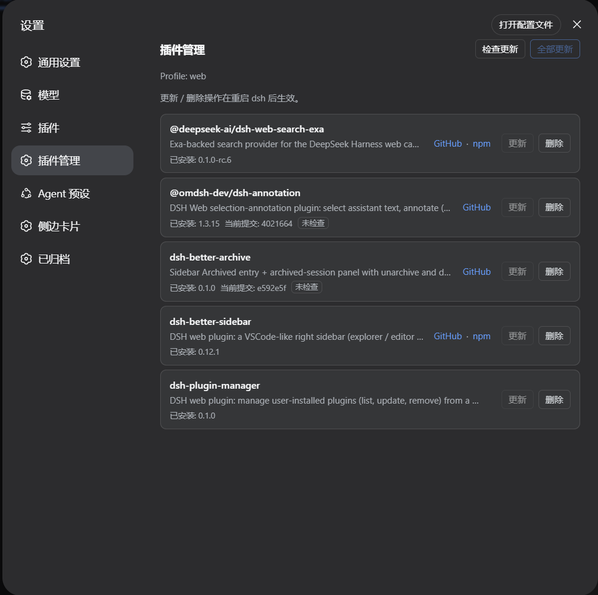

# DSH Plugin Manager

> 在 [DeepSeek Harness (DSH)](https://github.com/deepseek-ai/deepseek-harness) Web 设置中管理当前 profile 安装的插件。

`dsh-plugin-manager` 提供独立的「插件管理」页面，可以查看插件来源与版本、手动检查更新、更新单个或全部插件，以及删除不再需要的插件。

## 界面

<p align="center">
  
</p>

## 功能

- 列出当前 DSH profile 的直接依赖及已安装版本。
- 进入页面时只读取本地状态；点击「检查更新」后才访问 npm 或 GitHub。
- GitHub 分支源会比较 `pnpm-lock.yaml` 中的当前 commit 与远端 commit。
- 仅在确认存在新版本或新 commit 时启用更新按钮。
- 支持更新单个插件、更新全部可更新插件，以及删除插件。
- 更新和删除后按 DSH 的插件机制同步 `dsh.profile.bundles`。
- 页面文案跟随 DSH 的语言设置，支持中文和英文。

## 安装

需要 Node.js 22.19+ 和 pnpm。

```sh
dsh plugin --profile web add github:huahai0202/dsh-plugin-manager
```

安装完成后重启 `dsh web`，然后在「设置 → 插件管理」中使用。

## 使用说明

- 「检查更新」是唯一会主动访问远端的检查操作。
- GitHub 固定 commit 或 tag 会显示为固定引用，不会提示分支更新。
- `link:`、`file:` 等本地依赖只展示，不执行远端更新。
- pnpm 没有产生实际版本或 commit 变化时，页面会显示「已经是最新，无需更新」。
- 更新或删除完成后需要重启 `dsh web`，运行中的插件代码才会重新加载。

## 本地开发

```sh
dsh plugin --profile web add link:<path-to-this-checkout>
```

本地修改后重启 `dsh web`。提交前可运行：

```sh
node --check lib/index.js
node --check lib/client.js
npm pack --dry-run
```

## 开发接口

所有接口均使用 `POST`：

| 路由 | 请求体 | 用途 |
| --- | --- | --- |
| `/plugin-manager/api/list` | `{ "refresh": false }` | 读取本地插件状态 |
| `/plugin-manager/api/list` | `{ "refresh": true }` | 读取状态并检查 npm / GitHub 更新 |
| `/plugin-manager/api/update` | `{ "name": "package-name" }` | 更新单个插件 |
| `/plugin-manager/api/updateAll` | `{}` | 更新全部插件 |
| `/plugin-manager/api/remove` | `{ "name": "package-name" }` | 删除单个插件 |

## 目录

```text
dsh-plugin-manager/
├── assets/
│   └── screenshot.png     # README 截图
├── lib/
│   ├── index.js           # DSH Host API 与 pnpm 操作
│   └── client.js          # 设置页面 UI
├── cordis.patch.yml       # Host 挂载配置
├── package.json           # 插件声明
└── README.md
```

## License

[MIT](./LICENSE)
